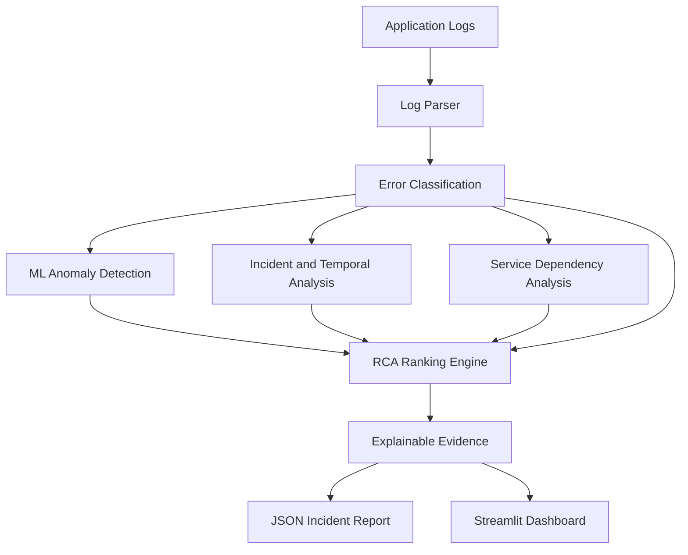

# AutoRCA Pro Max — Explainable Root Cause Analysis Engine

AutoRCA Pro Max is a research/engineering prototype for analyzing production-style application logs and ranking possible root causes of incidents.

It combines rule-based evidence, machine-learning anomaly detection, temporal incident analysis, service dependency information, and explainable evidence generation.

## Architecture



## Key Features

- Structured log parsing
- Error classification into:
  - Database
  - Network
  - Memory
  - Authentication
  - Unknown
- TF-IDF based log representation
- Isolation Forest anomaly detection
- Multi-log incident analysis
- Temporal burst detection
- Service dependency analysis using NetworkX
- Root-cause candidate ranking
- Explainable RCA evidence
- Interactive Streamlit dashboard
- JSON incident report generation
- Automated testing

## Machine Learning Approach

### TF-IDF

TF-IDF converts log messages into numerical text features that can be processed by the machine-learning pipeline.

### Isolation Forest

Isolation Forest identifies log messages that appear unusual compared with other messages in the analyzed dataset.

The anomaly signal is then used as one input to the RCA ranking process.

## Root Cause Ranking

AutoRCA combines multiple signals to rank possible root causes:

- Rule/evidence match
- Anomaly signal
- Error frequency
- Temporal concentration
- Affected service
- Dependency information

The final value is a **ranking score, not a probability**.

## Explainable RCA

AutoRCA provides human-readable evidence instead of returning only a root-cause label.

The evidence can include:

- Matched log phrases
- Dominant failure category
- Most affected service
- Repeated error evidence
- Anomaly signal
- Temporal incident patterns
- Dependency relationships

## Demo Result

The included sample dataset contains 20 log records.

Example analysis identifies:

- **Dominant Category:** DATABASE
- **Most Affected Service:** PaymentService
- **Top Candidate:** Database unavailable

These results are generated from the included sample dataset and are intended to demonstrate the system's analysis pipeline.

## Testing

The project includes automated tests for:

- Log parsing
- Error classification
- Root-cause ranking
- Anomaly detection
- Incident analysis
- Dependency analysis

Run the tests with:

```bash
python -m pytest -q
```

## Quick Start

### 1. Install dependencies

```bash
python -m pip install -r requirements.txt
```

### 2. Run tests

```bash
python -m pytest -q
```

### 3. Run CLI analysis

```bash
python -m src.main
```

### 4. Run Streamlit dashboard

```bash
streamlit run dashboard.py
```

Open the Streamlit URL shown in the terminal.

## Project Structure

```text
autorca/
├── data/
│   └── sample_logs.csv
├── reports/
│   └── .gitkeep
├── src/
│   ├── __init__.py
│   ├── log_parser.py
│   ├── root_cause_engine.py
│   ├── ml_anomaly_detector.py
│   ├── dependency_graph.py
│   ├── incident_engine.py
│   ├── xai_explainer.py
│   ├── report_generator.py
│   └── main.py
├── tests/
│   ├── test_log_parser.py
│   ├── test_root_cause.py
│   └── test_incident_engine.py
├── dashboard.py
├── requirements.txt
├── .gitignore
└── README.md
```

## Technology Stack

- **Python**
- **Pandas**
- **NumPy**
- **Scikit-learn**
- **NetworkX**
- **Streamlit**
- **Plotly**
- **Pytest**

## Current Validation

The current project test suite contains **16 automated tests**, covering core parsing, classification, anomaly detection, RCA, and incident-analysis behavior.

The included sample dataset is used for demonstration and validation.

## Limitations

AutoRCA Pro Max is a research/engineering prototype.

The current implementation works with a controlled CSV log dataset and does not claim guaranteed production root-cause identification.

A production-grade RCA platform would require richer and validated telemetry such as:

- Distributed traces
- Metrics
- Service topology
- Historical incidents
- Infrastructure events
- Container/Kubernetes information

## Future Research Directions

- OpenTelemetry trace ingestion
- Prometheus metric correlation
- Kubernetes topology integration
- Historical incident retrieval
- Transformer-based log embeddings
- Graph neural networks for dependency reasoning
- SHAP/LIME-based model analysis
- Streaming log ingestion
- Human feedback for RCA correction
- Docker/Kubernetes deployment

## Project Goal

The goal of AutoRCA Pro Max is to demonstrate how machine learning, rule-based reasoning, temporal analysis, dependency information, and explainability can be combined to assist engineers in investigating application incidents.